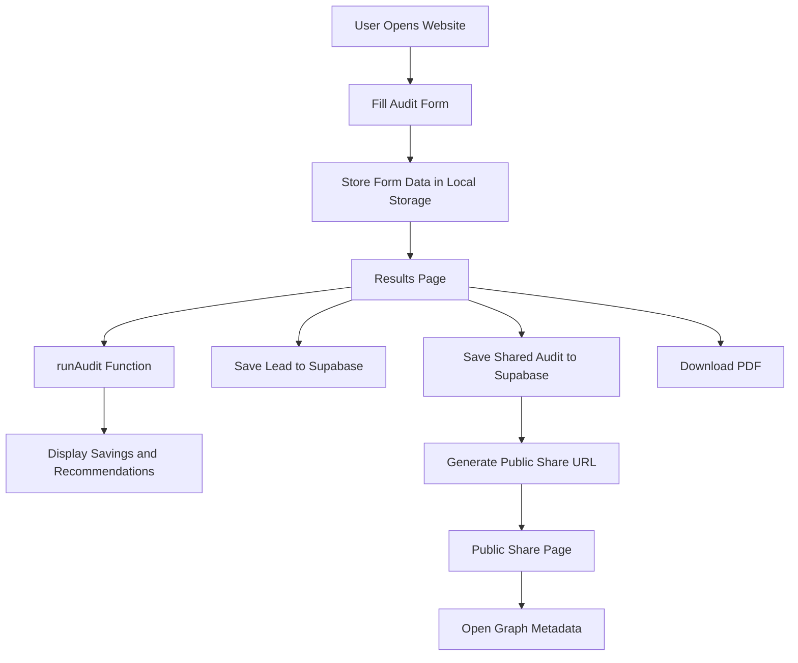

# Architecture

## System Diagram

## Data Flow

1. The user enters AI subscription details in the homepage form.
2. The form data is saved in browser localStorage.
3. The Results page reads the stored data.
4. The `runAudit()` function calculates recommendations and savings.
5. The application displays monthly and annual savings.
6. Lead information is stored in Supabase.
7. A public audit record is saved to the `shared_audits` table.
8. Supabase returns a unique ID.
9. The app generates a shareable URL in the format `/share/<id>`.
10. Users can download the audit as a PDF.

## Why I Chose This Stack

### Next.js

Provides fast routing, server rendering, and an excellent developer experience.

### TypeScript

Improves reliability with static type checking.

### Tailwind CSS

Enables rapid and consistent UI development.

### Supabase

Offers a hosted PostgreSQL database with built-in Row Level Security.

### jsPDF

Allows PDF generation directly in the browser.

### Vercel

Provides seamless deployment and automatic GitHub integration.

## Scaling to 10,000 Audits Per Day

If the application needed to handle 10,000 audits per day, I would:

1. Move audit calculations to server-side API routes.
2. Add caching for repeated calculations.
3. Use background jobs for PDF generation.
4. Add monitoring and error tracking.
5. Optimize database indexes and connection pooling.
6. Introduce rate limiting and abuse protection.
7. Store static assets using a CDN.